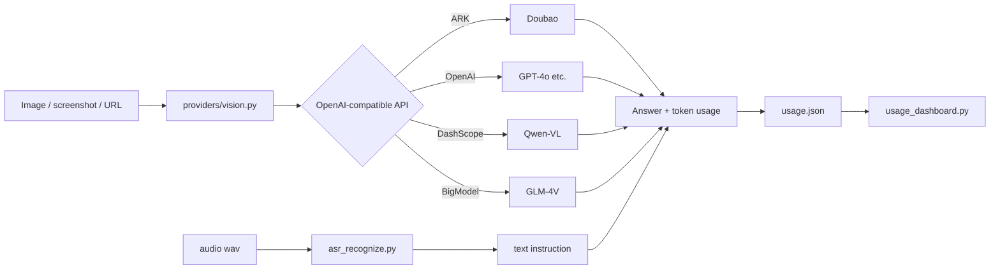

# doubao-multimodal-skill

> Give any AI assistant or pipeline the ability to **see images and transcribe speech**: vision recognition (any OpenAI-compatible multimodal model) + speech-to-text (Doubao ASR) + a visual usage dashboard.

  

## Background

In many workflows the host model cannot "see" an image directly (e.g. text-only models), or you want to automate OCR, figure understanding, or UI screenshot QA. This project packages **image recognition** and **speech recognition** into a reusable Codex skill:

- **Vision is provider-agnostic**: any OpenAI-compatible multimodal model works — Doubao (Volcano Ark), OpenAI GPT-4o, Qwen-VL (DashScope), Zhipu GLM-4V, or a local Ollama endpoint. Switching vendors is a single environment variable.
- **Speech recognition** uses Doubao ASR (HTTP standard edition) for wav/mp3/ogg files.
- **Usage dashboard**: every call logs the number of images and per-model token consumption, and a Tkinter panel shows the statistics in real time (how many images were recognized, and how many tokens each model used).

It started as a bridge for text-only models that need to "look" at images, but it is a general-purpose multimodal bridge.

## Features

- Multi-provider vision: `doubao / openai / qwen / zhipu / custom`, local images or image URLs
- OCR / chart / screenshot understanding: papers, flowcharts, whiteboards, UIs, tables
- ASR: local audio files to text
- Multimodal pipeline: voice instruction -> ASR -> image question -> combined answer
- Local usage dashboard (`usage_dashboard.py`): images recognized, per-model tokens, recent calls (stored in local `usage.json`, never uploaded)
- Embeddable: `providers/vision.py` is a complete, minimal OpenAI-compatible client

## How it works



## Quick start

### 1. Install

Clone or copy into the Codex skills directory:

```bash
git clone https://github.com/<your-name>/doubao-multimodal-skill.git
```

- Windows: `C:\Users\<you>\.codex\skills\doubao-multimodal`
- macOS / Linux: `~/.codex/skills/doubao-multimodal`

Dependencies (only `requests`; the GUI uses the standard-library tkinter):

```bash
pip install -r requirements.txt
```

### 2. Configure (at least one vision provider)

| Variable | Required | Description |
|---|---|---|
| `ARK_API_KEY` | Doubao | Volcano Ark API key |
| `ARK_MODEL_ID` | Doubao (recommended) | Model name or inference endpoint ID; **if the default model name is unavailable on your account, set your Ark endpoint ID here** |
| `OPENAI_API_KEY` | OpenAI | OpenAI key |
| `DASHSCOPE_API_KEY` | Qwen | DashScope key |
| `ZHIPU_API_KEY` | Zhipu | BigModel key |
| `VISION_API_KEY` / `VISION_BASE_URL` / `VISION_MODEL` | custom | Custom OpenAI-compatible endpoint |
| `DOUBAO_APP_ID` / `DOUBAO_TOKEN` / `DOUBAO_CLUSTER` | ASR | Doubao speech credentials |
| `USAGE_LOG` | no | Usage log path (default: `usage.json` in the repo root) |

Select a provider via the `VISION_PROVIDER` env var or the `--provider` CLI flag.

### 3. First example

```bash
python scripts/vision_recognize.py screenshot.png "What is in this image?"
python scripts/vision_recognize.py https://example.com/a.png "Describe the image" --url --provider openai --model gpt-4o-mini
python scripts/usage_dashboard.py
```

## Usage

### Vision recognition

```bash
python scripts/vision_recognize.py <image|url> [question] [--url] [--provider X] [--model Y] [--json]
```

Examples:

```bash
python scripts/vision_recognize.py paper_figure.png "What are the axes and the trend?"
python scripts/vision_recognize.py receipt.jpg "Read the amount and tax ID" --provider qwen
python scripts/vision_recognize.py ui_screenshot.png "Which buttons exist?" --json
```

`--json` also prints the provider, model, and token usage.

### Speech-to-text

```bash
python scripts/asr_recognize.py audio.wav
python scripts/asr_recognize.py --url https://example.com/audio.wav
```

### Multimodal pipeline

```bash
python scripts/multimodal_pipeline.py scene.jpg --audio question.wav
python scripts/multimodal_pipeline.py scene.jpg --question "Are there any pedestrians?"
```

### Usage dashboard

```bash
python scripts/usage_dashboard.py                        # live dashboard
python scripts/usage_dashboard.py --screenshot dashboard.png   # export a PNG (Windows)
```

The dashboard shows total calls / images / tokens, a per-model table, and the most recent 200 calls. Data lives in local `usage.json`.


## Project layout

```
doubao-multimodal-skill/
├── SKILL.md
├── README.md / README.en.md
├── LICENSE / requirements.txt / .gitignore
├── providers/
│   ├── __init__.py
│   └── vision.py
├── scripts/
│   ├── vision_recognize.py
│   ├── asr_recognize.py
│   ├── multimodal_pipeline.py
│   ├── voice_input.py
│   ├── usage_tracker.py
│   └── usage_dashboard.py
├── references/
│   └── api_reference.md
└── agents/
    └── openai.yaml
```

## FAQ

**Q1: Doubao returns `InvalidEndpointOrModel.NotFound`?** Your account may not have access to the default model name. Create an inference endpoint in the Ark console and set `ARK_MODEL_ID` (e.g. `ep-xxxxx`) or pass `--model ep-xxxxx`.

**Q2: No token numbers in the log?** Some vendors/models do not return a `usage` field; tokens are then logged as 0.

**Q3: Can I use a local model?** Yes, any service exposing an OpenAI-compatible `chat/completions` endpoint works, e.g. Ollama: `--provider custom --model llama3.2-vision`, with `VISION_BASE_URL=http://localhost:11434/v1`.

**Q4: Chinese text looks garbled on Windows console?** Run `chcp 65001`, or redirect output to a file.

## License

MIT
