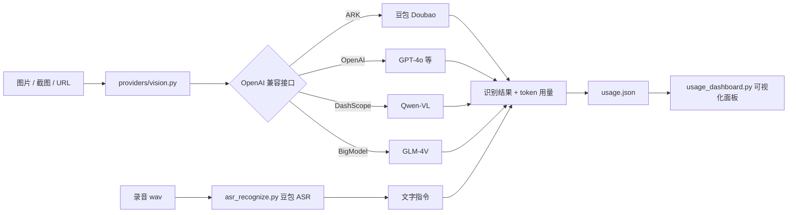
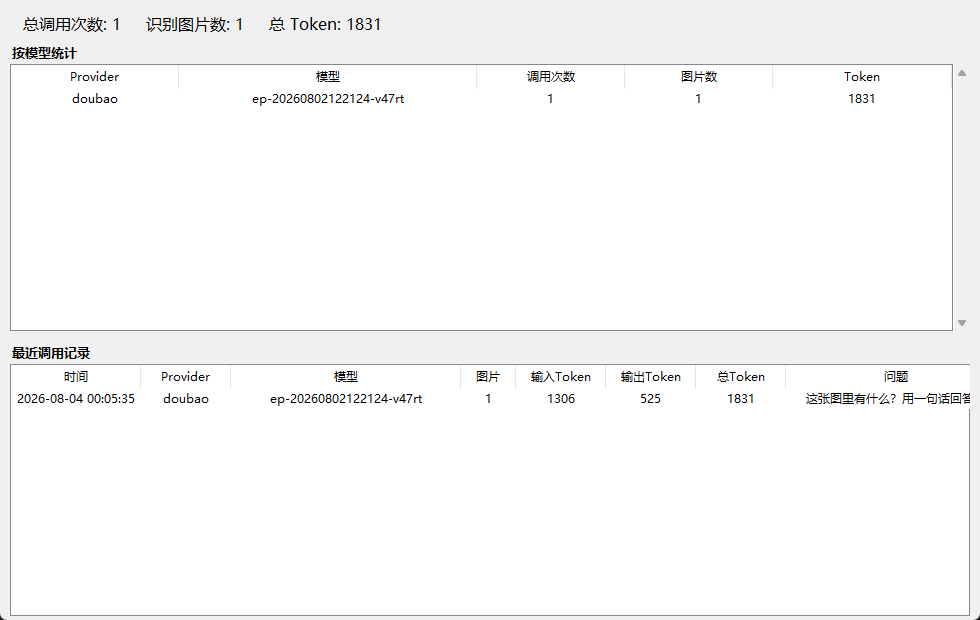

# doubao-multimodal-skill

> 让任何 AI 助手/流程拥有「看图 + 听写」能力的多模态技能：**视觉识别（任意 OpenAI 兼容的多模态模型）+ 语音转写（豆包 ASR）+ 可视化用量统计面板**。

  

## 背景

很多场景下，主模型（例如纯文本模型）无法直接"看"图片，或者你希望在自动化流程里对图片做 OCR、图表理解、界面截图质检。本项目把**图片识别**和**语音识别**封装成一个可复用的 Codex 技能：

- **图片识别不绑定某个厂商**：所有 OpenAI 兼容接口的多模态模型都能用——豆包（火山方舟）、OpenAI GPT-4o、通义千问 Qwen-VL、智谱 GLM-4V，甚至本地 Ollama。切换厂商只改一个环境变量。
- **语音转写**基于豆包语音 ASR（HTTP 标准版），把 wav/mp3/ogg 转成文字。
- **用量可视化**：每次识别自动记录图片张数、各模型消耗的 token，并提供一个 Tkinter 面板实时展示统计（识别了多少张图、每个模型用了多少 token）。

最初它是为了"纯文本模型临时看图"而做的，但它本质是一个通用的多模态能力桥，适用面更广。

## 特性

- ✨ **多 Provider 视觉层**：`doubao / openai / qwen / zhipu / custom` 一键切换，支持本地图片与图片 URL
- 🔍 **OCR / 图表 / 截图理解**：论文图、流程图、白板、UI 截图、表格图片都能问
- 🎙 **语音转写 ASR**：本地录音文件 → 文字
- 🔁 **多模态串联**：语音指令 → 转写 → 看图 → 综合回答（`multimodal_pipeline.py`）
- 📊 **用量统计面板**：`usage_dashboard.py` 显示累计识别图片数、各模型 token 用量与最近调用记录（数据存本地 `usage.json`，不联网上传）
- 🧩 **可嵌入业务代码**：`providers/vision.py` 是完整的 OpenAI 兼容调用示例，可直接参考或集成

## 工作原理



## 快速开始

### 1. 安装

克隆或复制到 Codex 的 skills 目录：

```bash
git clone https://github.com/<your-name>/doubao-multimodal-skill.git
```

- Windows：放到 `C:\Users\<you>\.codex\skills\doubao-multimodal`
- macOS / Linux：放到 `~/.codex/skills/doubao-multimodal`

依赖（仅 `requests`，GUI 用 Python 自带 tkinter）：

```bash
pip install -r requirements.txt
```

### 2. 配置（至少配一个视觉 Provider）

| 变量 | 必填 | 说明 |
|---|---|---|
| `ARK_API_KEY` | 豆包时必填 | 火山方舟 API Key（控制台开通视觉模型） |
| `ARK_MODEL_ID` | 豆包时建议 | 模型名或推理接入点 ID；**你的账号若默认模型名不可用，请填方舟推理接入点 ID** |
| `OPENAI_API_KEY` | OpenAI 时必填 | OpenAI Key |
| `DASHSCOPE_API_KEY` | 通义时必填 | DashScope Key |
| `ZHIPU_API_KEY` | 智谱时必填 | BigModel Key |
| `VISION_API_KEY` / `VISION_BASE_URL` / `VISION_MODEL` | custom 时必填 | 自定义 OpenAI 兼容端点 |
| `DOUBAO_APP_ID` / `DOUBAO_TOKEN` / `DOUBAO_CLUSTER` | 语音时必填 | 豆包语音三件套 |
| `USAGE_LOG` | 否 | 用量日志路径，默认项目根目录 `usage.json` |

选择 Provider 两种方式：环境变量 `VISION_PROVIDER`，或命令行 `--provider`。

### 3. 第一个例子

```bash
# 豆包看图（默认自动检测，也可显式指定）
python scripts/vision_recognize.py 截图.png "这张图里有什么？"

# 指定 OpenAI 兼容厂商
python scripts/vision_recognize.py https://example.com/a.png "描述图片内容" --url --provider openai --model gpt-4o-mini

# 查看用量面板
python scripts/usage_dashboard.py
```

## 用法详解

### 图片识别 / 视觉理解

```bash
python scripts/vision_recognize.py <本地图片或URL> [问题] [--url] [--provider X] [--model Y] [--json]
```

示例：

```bash
python scripts/vision_recognize.py paper_figure.png "这个图的横轴和纵轴是什么？趋势如何？"
python scripts/vision_recognize.py receipt.jpg "把发票上的金额和税号读出来" --provider qwen
python scripts/vision_recognize.py ui_screenshot.png "这个界面有哪些按钮？布局是否合理？" --json
```

`--json` 会额外输出 Provider、模型和 token 用量，方便脚本对接。

### 语音转写

```bash
python scripts/asr_recognize.py 录音.wav
python scripts/asr_recognize.py --url https://example.com/audio.wav
```

### 多模态串联（语音 → 看图 → 回答）

```bash
python scripts/multimodal_pipeline.py scene.jpg --audio 问题录音.wav
python scripts/multimodal_pipeline.py scene.jpg --question "这张图里有没有行人？"
```

### 用量统计面板

```bash
python scripts/usage_dashboard.py            # 打开实时面板
python scripts/usage_dashboard.py --screenshot dashboard.png   # Windows 下导出面板截图
```

面板显示：**累计调用次数 / 识别图片数 / 总 Token**，按模型分组的统计表，以及最近 200 条调用记录（时间、Provider、模型、图片数、输入/输出/总 token、问题摘要）。数据只存在本地 `usage.json`。



## 目录结构

```
doubao-multimodal-skill/
├── SKILL.md                    # 技能说明（Codex 识别入口）
├── README.md / README.en.md    # 中英文说明
├── LICENSE / requirements.txt / .gitignore
├── providers/
│   ├── __init__.py
│   └── vision.py               # 多 Provider 视觉调用（OpenAI 兼容）
├── scripts/
│   ├── vision_recognize.py     # 视觉识别 CLI
│   ├── asr_recognize.py        # 豆包语音转写 CLI
│   ├── multimodal_pipeline.py  # 语音+视觉串联
│   ├── voice_input.py          # 按键录音采集辅助
│   ├── usage_tracker.py        # 用量记录（usage.json）
│   └── usage_dashboard.py      # Tkinter 用量面板
├── references/
│   └── api_reference.md        # API 参考
└── agents/
    └── openai.yaml
```

## 常见问题

**Q1：豆包报 `InvalidEndpointOrModel.NotFound`？**
你的账号可能没有默认模型名的访问权限。在火山方舟控制台创建推理接入点，然后把接入点 ID 填入 `ARK_MODEL_ID`（例如 `ep-xxxxx`），或使用 `--model ep-xxxxx`。

**Q2：用量统计没有 token 数？**
部分厂商/模型不返回 `usage` 字段，此时记录 token 为 0；换用支持返回 usage 的模型即可。

**Q3：可以接入本地模型吗？**
可以。任何暴露 OpenAI 兼容 `chat/completions` 接口的服务都能用，例如本地 Ollama：`--provider custom --model llama3.2-vision --api-key 任意`，并设置 `VISION_BASE_URL=http://localhost:11434/v1`。

**Q4：Windows 控制台中文乱码？**
终端执行 `chcp 65001`，或把输出重定向到文件后查看。

## 许可证

MIT
